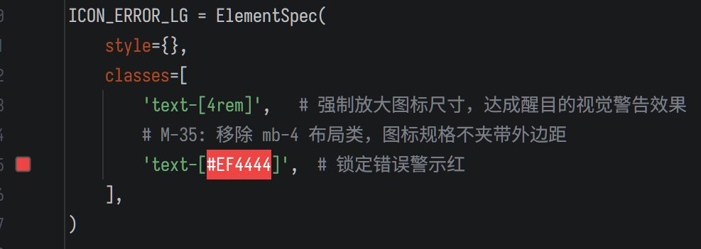

<h1 align="center">🎨 Smart Hex Preview</h1>

<p align="center">
  <b>IntelliJ / PyCharm Plugin</b> — <i>Inline hex color preview with click-to-edit</i><br>
  <b>IntelliJ / PyCharm 插件</b> — <i>十六进制颜色码行内预览 + 点击修改</i>
</p>

<p align="center">
  
</p>

---

## ✨ Features / 功能特性

### English

- **Inline color blocks** — Automatically recognizes `#XXXXXX` wrapped in `[]`, `()`, `'`, `"` and renders them as colored blocks
- **Smart contrast** — Text auto-switches between black/white based on background luminance
- **Gutter indicator** — A 12×12 clickable color block in the gutter next to each line
- **Click to edit** — Click the gutter block to open the system color picker; the hex value is replaced in-place (wrappers preserved)
- **Custom patterns** — Add your own regex patterns in `Settings | Tools | Smart Hex Preview`
- **Regex validation** — Invalid patterns are rejected with an error message
- **Any file type** — Works on the document layer (no PSI dependency), compatible with Python, JavaScript, CSS, HTML, Markdown, etc.
- **Debounced refresh** — 250ms debounce to avoid flickering during fast typing

### 中文

- **🎨 行内色块** — 自动识别被 `[]`、`()`、`'`、`"` 包裹的 `#XXXXXX`，渲染为对应颜色的背景块
- **🧠 智能对比色** — 根据背景亮度自动切换黑色/白色文字，确保可读性
- **📌 Gutter 指示器** — 行号右侧显示 12×12 可点击色块
- **🖱️ 点击修改** — 点击色块弹出系统颜色选择器，选中后原地替换 hex 值（保留包裹符）
- **⚙️ 自定义正则** — 在 `Settings | Tools | Smart Hex Preview` 中添加自定义识别模式
- **✅ 正则验证** — 无效正则会在添加/保存时弹错拦截
- **📄 任意文件类型** — 基于 Document 层（不依赖 PSI），兼容 Python、JavaScript、CSS、HTML、Markdown 等
- **⚡ 防抖刷新** — 250ms 防抖，快速输入时不闪烁

---

## 📦 Installation / 安装

### English

1. Download the latest release `.zip` from [Releases](https://github.com/kaipard/smart-hex-preview/releases) (or build it yourself — see below)
2. Open **PyCharm / IntelliJ IDEA**
3. Go to `File | Settings | Plugins`
4. Click the gear icon ⚙ → **Install Plugin from Disk...**
5. Select the downloaded `.zip` file
6. Restart the IDE

### 中文

1. 从 [Releases](https://github.com/kaipard/smart-hex-preview/releases) 下载最新版 `.zip`（或自行构建，参见下方）
2. 打开 **PyCharm / IntelliJ IDEA**
3. 进入 `File | Settings | Plugins`
4. 点击齿轮图标 ⚙ → **Install Plugin from Disk...**
5. 选择下载的 `.zip` 文件
6. 重启 IDE

---

## 🚀 Usage / 使用

### English

Open any file containing hex color codes wrapped in delimiters. For example, a Python file:

```python
primary   = [#2563EB]
secondary = (#10B981)
danger    = '#EF4444'
ink       = "#111827"
```

The plugin will:

- Render `#XXXXXX` as an inline colored block (text auto-switches black/white)
- Show a 12×12 color swatch in the gutter
- Click the gutter swatch → color picker opens → choose a new color → hex value is updated automatically

### 中文

打开任意包含包裹符内 hex 颜色码的文件。例如 Python 文件：

```python
primary   = [#2563EB]
secondary = (#10B981)
danger    = '#EF4444'
ink       = "#111827"
```

插件会自动：

- 将 `#XXXXXX` 渲染为对应颜色的背景块（文字自动切换黑/白）
- 在行号右侧显示 12×12 色块
- 点击色块 → 弹出颜色选择器 → 选择新颜色 → hex 值自动更新

---

## ⚙️ Settings / 设置

### English

`Settings | Tools | Smart Hex Preview` — Manage custom regex patterns:

- **Add** — Enter a new regex pattern (use a capturing group around `#XXXXXX`, e.g. `\[(#[0-9A-Fa-f]{6})\]`)
- **Remove** — Remove the selected pattern
- **Reset to Defaults** — Restore the 4 default patterns
- **Validation** — Invalid regex patterns are rejected when adding or applying

### 中文

`Settings | Tools | Smart Hex Preview` — 管理自定义正则模式：

- **Add** — 输入新正则模式（用捕获组包裹 `#XXXXXX`，例如 `\[(#[0-9A-Fa-f]{6})\]`）
- **Remove** — 删除选中的模式
- **Reset to Defaults** — 恢复 4 个默认模式
- **验证** — 无效正则会在添加或保存时弹错拦截

---

## 🔧 Build from source / 源码构建

### Requirements / 要求

| Tool / 工具 | Version / 版本 |
|-------------|----------------|
| JDK | 11+ |
| Gradle | 8.9 (wrapper included) |
| IntelliJ Platform | 2022.1+ |

### Steps / 步骤

```bash
# Clone / 克隆
git clone https://github.com/kaipard/smart-hex-preview.git
cd smart-hex-preview

# Build / 构建
./gradlew buildPlugin
```

The installable zip will be produced at:

```
smart-hex-preview/build/distributions/smart-hex-preview-1.0.0.zip
```

---

## 📁 Project structure / 项目结构

```
smart-hex-preview/
├── build.gradle.kts                    # Gradle build config
├── settings.gradle.kts                 # Gradle settings
├── gradle.properties                   # Gradle properties
├── gradle/wrapper/                     # Gradle wrapper
├── images/
│   └── example.jpg                     # Screenshot for README
├── src/main/
│   ├── kotlin/smarthex/
│   │   ├── HexHighlightingService.kt   # Core: inline highlights + refresh logic
│   │   ├── HexGutterProvider.kt        # Gutter icon renderer
│   │   ├── HexColorPickerHandler.kt    # Color picker → replace flow
│   │   ├── HexPatternConfig.kt         # Persistent regex pattern config
│   │   ├── HexStartupActivity.kt       # Startup initialization
│   │   └── SettingsPanel.kt            # Settings UI page
│   └── resources/META-INF/
│       └── plugin.xml                  # Plugin descriptor
└── build/
    └── distributions/
        └── smart-hex-preview-1.0.0.zip # Build output
```

---

## 🧩 Compatibility / 兼容性

| IDE | Supported / 支持 |
|-----|:----------------:|
| PyCharm Community / Professional | 2022.1+ ✅ |
| IntelliJ IDEA Community / Ultimate | 2022.1+ ✅ |
| WebStorm / GoLand / Other JetBrains IDEs | 2022.1+ ✅ |

---

## 📝 License / 许可

```
MIT License

Copyright (c) 2026 SmartHex

Permission is hereby granted, free of charge, to any person obtaining a copy
of this software and associated documentation files...
```

---

<p align="center">
  Made with ❤️ for the JetBrains community
</p>